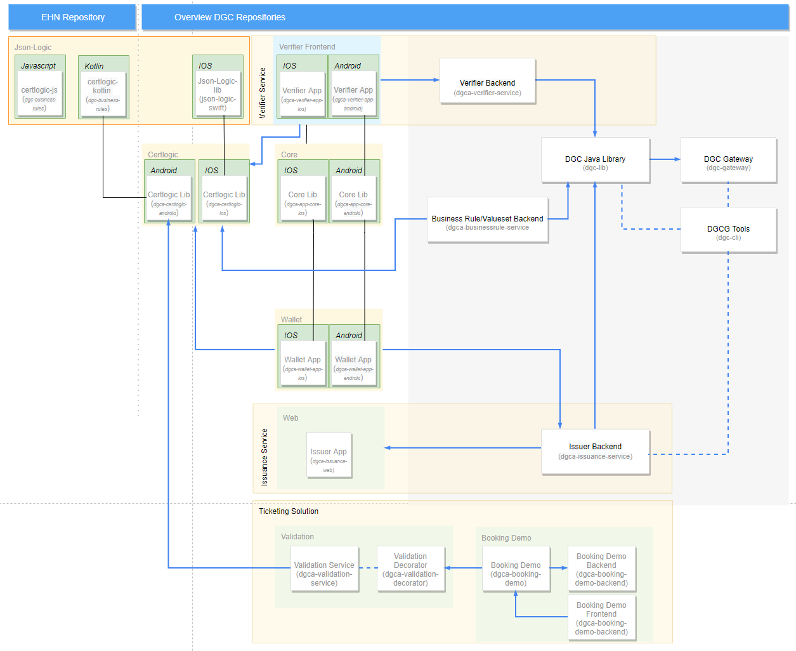

<h1 align="center">
 EU Digital COVID Certificate: Overview
</h1>

    <a href="#where-can-i-find-">Where can I find ...</a> •
    <a href="#architectural-overview">Architectural Overview</a> •
    <a href="#about-this-project">About this Project</a> •
    <a href="#credits">Credits</a> •
    <a href="#how-to-contribute">How to Contribute</a> •
    <a href="#licensing">Licensing</a>

## Where can I find ... 

This repository provides an overview over the EU Digital COVID Certificate (DGC) project, and acts as a central storage for various useful documents related to the project. The table below acts as navigation aid to find the information you are looking for.

| Topic                   | Link                                            | Description                                                                  |
|-------------------------|-------------------------------------------------|------------------------------------------------------------------------------|
| General Discussion      |   | General discussion and questions regarding Digital Green Certificates. |
| Slack                   | [Slack Workspace], [DGC Channel]                | The Linux Foundation Public Health Slack channel for developer discussions.  |
| Member State Onboarding | [dgc-participating-countries]                   | Relevant information for participating countries.                            |
| Guides                  | [guides]                                        | General guides related to DGC.                                               |
| API Tests               | [dgc-api-tests]                                 | Automated API test cases for DGCG.                                           |
| Test Specifications     | [test-specifications]                           | Contains specification for acceptance test on gateway-API and DGCA-E2E Tests.   | 
| Specification           | [hcert-spec]                                    | Specification developed by the eHealth Network Interoperability Subgroup.    |
| EU eHealth Network      | https://ec.europa.eu/health/ehealth/covid-19_en | Further information and specifications regarding DGC.                        |
| Source Code             | [DGC Github Organisation Profile]               | A list of all other repositories, especially for the component source codes. |
| DCC Debugging           | [DCC Credential Debugger]                       | The prefixed version of the base45 can be added to read the content of a DCC |
| DCC Debugging           | [CBOR Debugger]                                 | The Binary Content of the COSE Payload can be debugged in this tool. 

[dgc-participating-countries]: https://github.com/eu-digital-green-certificates/dgc-participating-countries
[onboarding checklist]: https://github.com/eu-digital-green-certificates/dgc-participating-countries/blob/main/gateway/OnboardingChecklist.md
[guides]: ./guides
[test-specifications]: ./test-specification
[dgc-api-tests]: https://github.com/eu-digital-green-certificates/dgc-api-tests
[hcert-spec]: https://github.com/ehn-digital-green-development/hcert-spec
[Slack Workspace]: https://join.slack.com/t/lfpublichealth/shared_invite/zt-e9vj5tl2-DFJ6z~q0Y6_Tm_SZVymctw
[DGC channel]: https://lfpublichealth.slack.com/archives/C01UZFNU3M0
[DGC Github Organisation Profile]: https://github.com/eu-digital-green-certificates
[DCC Credential Debugger]: https://github.pathcheck.org/debug.html
[CBOR Debugger]: http://cbor.me/

## Architectural Overview

## About this Project

The digital green certificate implements the EU trustframework according the specification of the eHealth Network Interoperability Subgroup (https://github.com/ehn-digital-green-development/hcert-spec). 

To this end the European Commission has tasked Deutsche Telekom and SAP to develop the [Digital Green Certificates Gateway](https://github.com/eu-digital-green-certificates/dgc-gateway) as well as applications that may be used by all countries connected to the gateway. These include a national backend with an issuer component ( [Issuance Service](https://github.com/eu-digital-green-certificates/dgca-issuance-service), [Issuance Web](https://github.com/eu-digital-green-certificates/dgca-issuance-web) ) and an app to validate Digital Green Certificates ( [Verifier Service](https://github.com/eu-digital-green-certificates/dgca-verifier-service), [Verifier App - Android](https://github.com/eu-digital-green-certificates/dgca-verifier-app-android), [Verifier App - iOS](https://github.com/eu-digital-green-certificates/dgca-verifier-app-ios) ) as well as a wallet app to be used by the citizens of connected countries ( [Wallet App - Android](https://github.com/eu-digital-green-certificates/dgca-wallet-app-android), [Wallet App - iOS](https://github.com/eu-digital-green-certificates/dgca-wallet-app-ios) ).

Further information can be found at https://ec.europa.eu/health/ehealth/covid-19_en 

**A note on using the apps and released APK files found in this GitHub organization**: The apps are reference implementations that cannot be used in production environments as-is, but rather need to be configured by EU member states to access their national backends. The released APK files are configured to work with the test environments and will not report correct results on "live" DCCs.

## Credits

We'd like to thank all the partners who have been involved in this project from the beginning. Special mention is due to the eHealth Network Interoperability Subgroup that creates the [specification](https://github.com/ehn-digital-green-development/hcert-spec) for this project. 

## How to contribute  

Contribution and feedback is encouraged and always welcome. For more information about how to contribute, the project structure, as well as additional contribution information, see our [Contribution Guidelines](./CONTRIBUTING.md). By participating in this project, you agree to abide by its [Code of Conduct](./CODE_OF_CONDUCT.md) at all times.

## Licensing

Copyright (C) 2021 T-Systems International GmbH and all other contributors

Licensed under the **Apache License, Version 2.0** (the "License"); you may not use this file except in compliance with the License.

You may obtain a copy of the License at https://www.apache.org/licenses/LICENSE-2.0.

Unless required by applicable law or agreed to in writing, software distributed under the License is distributed on an "AS IS" BASIS, WITHOUT WARRANTIES OR CONDITIONS OF ANY KIND, either express or implied. See the [LICENSE](./LICENSE) for the specific language governing permissions and limitations under the License.
