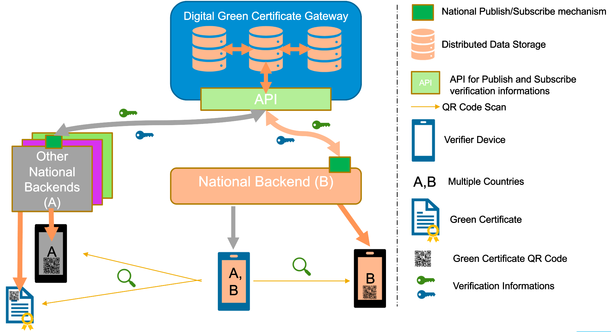
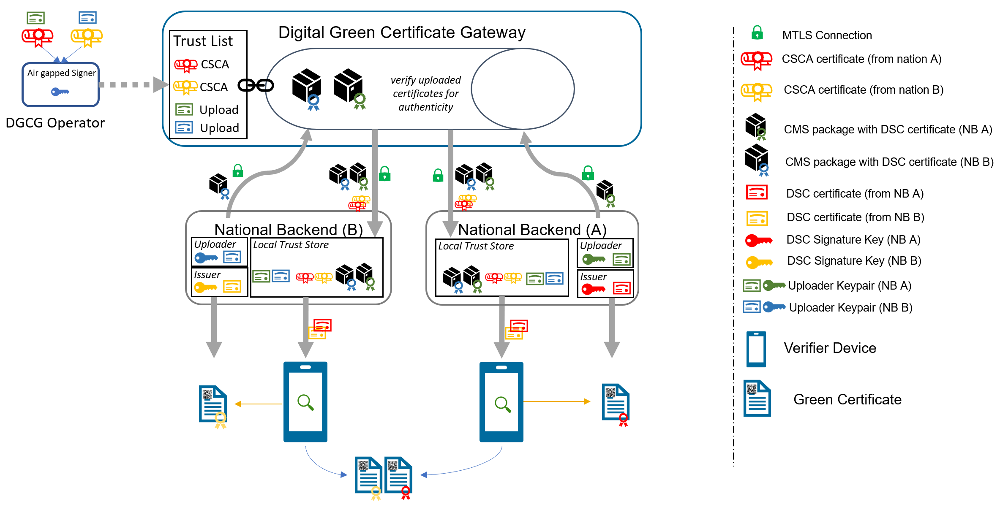
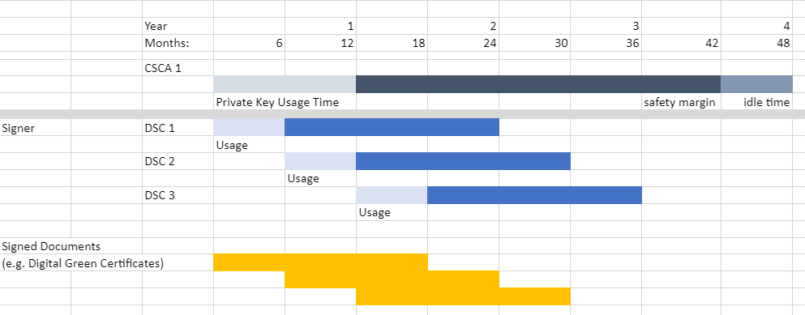

# Digital Green Certificate – Public Key Certificate Governance

## 1.1 Context

The secure and trusted exchange of signature keys for digital green certificates (DGCs) between European Countries is realized by the Digital Green Certificate Gateway (DGCG) which acts as a central repository for the public keys. With the DGCG, member states are empowered to publish the public keys that they use to sign digital green certificates. Relying member states can use the DGCG to fetch up-to-date public key material on a timely basis. Later, the DGCG can be extended to exchange trustworthy supplementary information that the member states provide, like validation rules for digital green certificates.
The trust model of the European DGC framework is a Public Key Infrastructures (PKI). Each member state maintains one or more Country Signing Certificate Authority (CSCA), certificates of which are relatively long lived. The CSCA issues public key certificates for the national, short lived, Document Signers (i.e. signers for digital green certificates), which are called Document Signer Certificates (DSCs). The CSCA acts as a trust anchor such that relying member states can use the CSCA certificate to validate the authenticity and integrity of the regularly changing DSC certificates. Once validated, the memberstates can provide these certificates (or just the public keys contained therein) to their DGC validation applications.  

Besides CSCAs and DSCs, the DGCG *also* relies on PKI to authenticate transactions, sign data, as the basis for authentication and as a means to ensure integrity of the communication channels between the memberstates and the DGCG. 

The following picture presents a high-level overview of the system.

##	1.2 Scope of Document
Digital signatures can be used to achieve data integrity and authenticity. Public Key Infrastructures establish trust by binding public keys to verified identities (or issuers). This is necessary to allow other participants to verify the data origin and the identity of the communication partner and decide about trust. In the DGCG, multiple public key certificates are used for authenticity. This document defines which public key certificates are used and how they should be designed in order to allow broad interoperability between the different member states. This document is based on [1] and [2]. It provides more details on the necessary public key certificates and it gives guidance on certificate templates and validity periods for countries that want to operate their own CSCA. 
Since DGCs shall be verifiable for a defined timeframe (starting from the issuing, expire after a given time), it is necessary to define a verification model for all signatures applied on the public key certificates and the digital green certificate. 
Legal and administrative procedures are not in the scope of this document, they must be defined separately.  

## 1.3	Terminology
The key words "MUST", "MUST NOT", "REQUIRED", "SHALL", "SHALL NOT", "SHOULD", "SHOULD NOT", "RECOMMENDED", "NOT RECOMMENDED", "MAY", and "OPTIONAL" in this document are to be interpreted as described in BCP 14 ([RFC2119](https://tools.ietf.org/html/rfc2119), [RFC8174](https://tools.ietf.org/html/rfc8174)) when, and only when, they appear in all capitals, as shown here.

The following table contains abbreviations and terminology used throughout this document.

| Term	 | Definition |
| ------|  -----------|
|Certificate|	Or public key certificate. An X.509 v3 certificate that contains the public key of an entity 
|CSCA|	Country Signing Certificate Authority. The name is used in accordance to [2]
|DGC|	Digital Green Certificate. A signed digital document that contains vaccination, test or recovery information (see [2])
|DGCG|	The Digital Green Certificate Gateway. This system is used to exchange DSCs between the member states
|DGCGTA|	The Trust Anchor certificate of the DGCG. The corresponding private key is used to sign the list of all CSCA certificates offline
|DGCGTLS|	The TLS server certificate of the DGCG
|DSC|	Document Signer Certificate. The Public Key Certificate of a member states Document Signing Authority (e.g. a system that is allowed to sign DGCs). This certificate is issued by the CSCA of the member state
|EC-DSA|	Elliptic Curve Digital Signature Algorithm. A cryptographic signature algorithm based on elliptic curves
|Member State| Member state of the European Union (currently 27) or a third country in scope of the system (e.g. based on an adequacy decision)
|mTLS|	Mutual TLS. The Transport Layer Security Protocol with mutual authentication
|NB|	National Backend of a Member State
|NBCSCA|	The CSCA certificate of a member state (could be more than one)
|NBTLS|	The TLS client authentication certificate of a national backend 
|NBUP|	The certificate that a national backend uses to sign data packages that are uploaded to the DGCG
|PKI|	Public Key Infrastructure. Trust model based on public key certificates and certificate authorities 
|RSA|	Asymmetric cryptographic algorithm based on integer factorization used for digital signatures or asymmetric encryption

# 2	DGCG communication flows and security services
This section gives an overview of the communication flows and security services in the DGCG system. It also defines which keys and certificates are used to protect the communication, the uploaded information, the digital green certificates, and a signed trust list that contains all onboarded CSCA certificates. The following figure gives a high-level overview of the DGCG communication flow and security services. The following sub-sections will explain the design in more detail.

## 2.1	General
The DGCG works as a data hub that allows the exchange of signed data packages for registered EU Member States. In the current phase, the signed data packages contain the Document Signer Certificates that are used by the member states. This allows other national backends to fetch them and distribute the information to their validation apps. Even if the DSCs are already signed by the CSCA, this approach allows to extend the system later to allow national backends the upload of different, generally unsigned, content (like validation rules). 

Uploaded data packages are provided by the DGCG “as is”, meaning that the DGCG does not add or delete DSCs from the packages it receives. The national backend (NB) of the Member States shall be enabled to verify the end-to-end integrity and authenticity of the uploaded data (see Section 2.4). 

In addition to this - National Backends and the DGCG will use mutual TLS authentication to establish a secure connection (see Section 2.2). So this is in _addition_ to the signatures in the data exchanged.

## 2.2	Authentication and connection establishment
The DGCG uses Transport Layer Security (TLS) with mutual authentication to establish an authenticated encrypted channel between the Member State’s national backend (NB) and the Gateway environment. Therefore, the DGCG holds a TLS server certificate, abbreviated DGCGTLS - and the National Backends hold a TLS client certificate – abbreviated NBTLS. Certificate templates are provided in Section 4. \
It was jointly decided that every national backend can provide their own TLS certificate. This certificate will be whitelisted explicitly and thus may be issued by a publicly trusted certificate authority (e.g. a certificate authority that follows the baseline requirements of the CA Browser forum), by a national certificate authority or it can be self-signed. Every Member State is responsible for their national data and the protection of the private key used to establish the connection to the DGCG. Clearly, the “bring your own certificate” approach requires a well-defined registration and identification process as well as revocation and renewal procedures that are described in Section 3.1. \
The DGCG uses a whitelist where the TLS certificates of NBs are added after their successful registration. Only NBs that authenticate themselves with a private key that corresponds to a certificate from the whitelist can establish a secure connection to the DGCG. \
The DGCG will also use a TLS certificate that allows the NBs to verify that they are indeed establishing a connection to the “real” DGCG and not some malevolent entity posing as DGCG. The certificate of the DGCG will be provided to the NBs after successful registration. The DGCGTLS certificate will be issued from a publicly trusted CA (included in all major browsers). It is the responsibility of the Member States to verify that their connection to the DGCG is secure (for example by checking the fingerprint of the DGCGTLS certificate of the server connected to against the one provided post registration).

## 2.3	Country Signing Certificate Authorities and Validation Model
All member states that take part in the DGCG framework MUST use a CSCAs to issue the DSCs. Member states MAY have more than one CSCA, e.g. in case of regional devolution.
It was jointly decided that each member state can either use existing certificate authorities or they can setup a dedicated (possibly self-signed) certificate authority for the DGC system.
The member states MUST present their CSCA certificate(s) to the DGCG operator during the official onboarding procedure. After successful registration of the member state (see section 3.1 for more details), the DGCG operator will update a signed trust list that contains all CSCA certificates that are active in the DGC framework. The DGCG operator will use a dedicated asymmetric key pair to sign the trust list and the certificates in an offline environment. The private key will not be stored on the online DGCG system, such that a compromise of the online system does not enable an attacker to compromise the trust list. The corresponding trust anchor certificate DGCGTA, will be provided to the National Backends during the onboarding process. Member states can retrieve the trust list from the DGCG for their verification procedures.
The CSCA is defined as the certificate authority that issues DSCs, hence member states that use a multi-tier CA hierarchy (e.g. Root CA -> CSCA -> DSCs) MUST provide the subordinary certificate authority that issues the DSCs. 
So in this case - if a member state uses an existing certificate authority then the DGC system will _ignore_ anything above the CSCA -- and whitelist only the CSCA as the trust anchor (even though it is a sub-ordinate CA). This is as the ICAO model [2] only allows for exactly 2 levels - a 'root' CSCA and a single 'leaf' DSC signed by just that CSCA.
In case that a member state operates its own CSCA, the member state is responsible for the secure operation and key management of this CA. It must be noted that the CSCA acts as the trust anchor for DSCs and therefore, protecting the private key of the CSCA is essential for the integrity of the DGC environment. \
The verification model in the DGC PKI is the shell model (for example, defined in [3]), which states that all certificates in the certificate path validation must be valid at a given time (i.e. the time of signature validation). Therefore, the following restrictions apply:
-	The CSCA SHALL NOT issue certificates that are longer valid than the CA certificate itself (see [2, Section 5])
-	The document signer SHALL NOT sign documents that are longer valid than the DSC itself
Member states that operate their own CSCA MUST define validity periods for their CSCA and all issued certificates and they MUST take care of certificate renewal. Section 3.2 contains recommendations for validity periods. 

## 2.4	Integrity and authenticity of uploaded data
National backends can use the DGCG to upload and download digitally signed data packages after successful mutual authentication. In the beginning, these data packages contain the DSCs of the member states. \
The key pair that is used by the national backend for the digital signature of uploaded data packages in the DGCG system is called National Backend upload signature key pair and the corresponding public key certificate is abbreviated by NBUP certificate. Each Member State brings its own NBUP certificate, which can be self-signed, or issued by an existing certificate authority, such as a public certificate authority (i.e. a certificate authority that issues certificate in accordance with the CAB-Forum baseline requirements). The NBUP certificate shall be different from any other certificates used by the member state (i.e. CSCA, TLS client or DSCs). \
The member states MUST provide the upload certificate to the DGCG operator during the initial registration procedure (see Section 3.1 for more details). Every Member State is responsible for their national data and it must protect the private key that is used for signing the uploads. Other member states can verify the signed data packages using the upload certificates that are provided by the DGCG. \
The DGCG verifies the authenticity and integrity of the uploaded data with the NB upload certificate before they are provided to other member states.

## 2.5	Requirements on the technical DGCG architecture
The requirements on the technical DGCG architecture can be summarized as follows:
-	The DGCG uses mutual TLS authentication to establish an authenticated encrypted connection with the NBs. Therefore, the DGCG maintains a whitelist of registered NBTLS client certificates
-	The DGCG uses two digital certificates (DGCGTLS and DGCGTA) with two distinct key pairs. The private key of the DGCGTA key pair is maintained offline (not on the online components of the DGCG) 
-	The DGCG maintains a trust list of the NBCSCA certificates that is signed with the DGCGTA private key
- The ciphers used MUST meet the requirements from Section 4.1
# 3	 Certificate Lifecycle Management
## 3.1	 Registration of National Backends
Member States MUST register with the DGCG operator to take part in the DGCG system. This section describes the technical and operational procedure that MUST be followed to register a national backend. Legal and administrative procedures are not in the scope of this document, they must be defined separately. \
The DGCG operator and the Member State MUST exchange information on technical contact persons for the onboarding process. It is assumed that the technical contact persons are legitimated by their Member States and identification/authentication is performed over other channels. For example, the authentication can be achieved when the Member States technical contact provides the certificates as password-encrypted files via E-Mail and shares the corresponding password with the DGCG operator via telephone. \
The Member State MUST provide three digital certificates during the registration and identification process:
-	The Member States TLS certificate NBTLS 
-	The Member States upload certificate NBUP
-	The Member States CSCA certificate(s) NBCSCA

All provided certificate MUST adhere to the requirements defined in Section 4. The DGCG operator will verify that the provided certificate adheres to the requirements of Section 4.   
After the identification and registration, the DGCG operator
-	adds the NBCSCA certificate(s) to the trust list signed with the private key that corresponds to the DGCGTA public key  
-	adds the NBTLS certificate to the whitelist of the DGCG TLS endpoint
-	adds the NBUP certificate to the DGCG system
-	provides the DGCGTA and DGCGTLS public key certificate to the member state

## 3.2	Certificate authorities, validity periods and renewal
In case that a member state wants to operate its own CSCA, the CSCA certificates will most probably be self-signed certificates. They act as the trust anchor of the member state and therefore the member state must strongly protect the private key corresponding to the CSCA certificate’s public key. It is recommended that the member states use an offline system for their CSCA, i.e. a computer system that is not connected to any network. Multi person control should be used to access the system (e.g. following the four eyes principle). After signing DSCs, operational controls should be applied and the system that holds the private CSCA key should be stored safely with strong access controls. Hardware Security Modules or Smart Cards can be used to further protect the CSCA private key. 

#### Validity periods
Digital certificates contain a validity period that enforces certificate renewal. Renewal is necessary to use fresh cryptographic keys and to adapt the key sizes when new improvements in computation or new attacks threaten the security of the cryptographic algorithm that is used.  The shell model applies (see Section 2.3).
The following validity periods are recommended based on the assumption of the one-year maximum validity for digital green certificates:

  -	CSCA: 4 years
  -	DSC: 2 years
  -	Upload: 1-2 years
  -	TLS Client authentication: 1-2 years
  
For a timely renewal, the following usage period for the private keys are recommended:
-	CSCA: 1 year 
-	DSC: 6 months

Member states MUST create new upload certificates and TLS certificates timely, e.g. one month, before expiration in order to allow smooth operation. CSCA and DSC SHOULD be renewed at least one month before the private key usage ends (considering the necessary operational procedures). Member states MUST provide updated CSCA, upload and TLS certificates to the DGCG operator. \
Expired certificates SHALL be removed from the whitelist and trust list. \
Member states and the DGCG operator MUST keep track of the validity of their own certificates. There is no central entity that keeps record of the certificate validity and informs the participants. \
The following picture shows the private key usage periods and certificate lifetimes for the recommended times in case that member states want to operate their own CSCA (assuming one-year maximum lifetime of signed documents). 

 

Member states might define different validity periods for their public key certificates.

## 3.3	Revocation of certificates
In general, digital certificates can be revoked by their issuing CA using certificate revocation lists or Online Certificate Status Responder. CSCAs for the DGC system SHOULD provide certificate revocation lists (CRLs). Even if these CRLs are currently not used by other member states (see [2, Section 5.1]), they SHOULD be integrated for future applications. In case a CSCA decides not to provide CRLs, the DSC certificates of this CSCA must be renewed when CRLs become mandatory. \
A CSCA SHOULD NOT use the Online Certificate Status Protocol (OCSP) for their DSCs, due to privacy concerns. Verifiers SHOULD NOT use OCSP for validation of the DSCs and SHOULD use CRLs.  It is RECOMMENDED that the national backend performs necessary validation of DSC certificates downloaded from the DGC Gateway and only forward a set of trusted and validated DSC to national DGC validators. DGC validators SHOULD NOT perform any revocation checking on DSC in their validation process. One reason for this is to protect the privacy of DGC holders by avoiding any chance that the use of any particular DSC can be monitored by its associated OCSP responder. \
Member states can remove their DSCs from the DGCG on their own using valid upload and TLS certificates. It must be noted that removing a DSC certificate will mean that all DGCs issued with this DSC will become invalid when member states fetch the updated DSC lists. Clearly, the protection of private key material corresponding to DSCs is crucial. \
Member States MUST inform the DGCG operator when they must revoke upload or TLS certificates, for example due to compromise of the national backend. The DGCG operator can then remove the trust for the affected certificate, e.g. by removing it from the TLS whitelist. The DGCG operator can remove the upload certificates from the DGCG database. Packages signed with the private key corresponding to this upload certificate will become invalid when national backends remove the trust of the revoked upload certificate.  \
In case that a CSCA must be revoked, member states SHALL inform the DGCG operator as well as other member states that they have trust relationships with.  The DGC opertor will issue a new trust list where the affected certificate is not contained anymore. All DSCs issued by this CSCA will become invalid when member states update their national backend trust store. \
In case that the DGCGTLS certificate or the DGCGTA certificate must be revoked, the DGCG operator and the Member States must work together to establish a new trusted TLS connection and trust list.

# 4	 Certificate Templates
The following sections contain cryptographic requirements and guidance as well as requirements on certificate templates. For the DGCG certificates, this section defines the certificate templates. 

## 4.1	 Cryptographic requirements
Cryptographic algorithms and TLS cipher suites shall be chosen based on the current recommendation from the German Federal Office for Information Security (BSI) or SOG-IS. These recommendations and the recommendations of other institutions and standardization organization are quite similar. The recommendations can be found in the technical guidelines  TR 02102-1 and TR 02102-2 ([source](https://www.bsi.bund.de/EN/Service-Navi/Publications/TechnicalGuidelines/tr02102/tr02102_node.html)) or SOG-IS Agreed Cryptographic Mechanisms ([source](https://www.sogis.eu/uk/supporting_doc_en.html)). 
### Requirements on the DSC
The requirements from [2, Section 3.3.2] apply. Hence, it is strongly RECOMMENDED that Document Signers use the Elliptic Curve Digital Signature Algorithm (ECDSA) with NIST-p-256 (as defined in appendix D of FIPS PUB 186-4). Other elliptic curves are not supported.
Due to the space restrictions of the digital green certificate, member states SHOULD NOT use RSA-PSS, even if it is allowed as a fallback algorithm. In case that member states use RSA-PSS, they SHOULD use a modulus size of 2048 or max. 3072 bit.
SHA-256 SHALL be used as cryptographic hash function (see ISO/IEC 10118-3:2004).
### Requirements on TLS, Upload and CSCA 
For digital certificates and cryptographic signatures in the DGCG context, the major requirements on cryptographic algorithms and key length are summarized in the following table (as of 2021):

|Signature Algorithm|	Key size	|Hash function|
|-------------------|-----------| -------------|
|EC-DSA| Min. 250 Bit| 	SHA-2 with an output length  ≥ 256 Bit 
|RSA-PSS (recommended padding)  RSA-PKCS#1 v1.5 (legacy padding) |	Min. 3000 Bit RSA Modulus (N) with a public exponent e > 2^16	| SHA-2 with an output length  ≥ 256 Bit
|DSA|	Min. 3000 Bit prime p, 250 Bit key q	|SHA-2 with an output length  ≥ 256 Bit |

The recommended elliptic curve for EC-DSA is again NIST-p-256 due to its widespread implementation.

## 4.2	CSCA certificate (NBCSCA)
The following table gives guidance on the NBCSCA certificate template in case that a member state decides to operate its own CSCA for the DGC system. **Bold** entries are required (MUST be included in the certificate), *italic* entries are recommended (SHOULD be included). For absent fields, no recommendations are defined.
|Field | Value|
|------| -----|
|**Subject**|	**cn= \<non-empty and unique common name\>**, *o=\<Provider\>* ,**c=\<Member State operating the CSCA\>**|
|**Key Usage** |	**certificate signing**, *CRL signing* (at minimum)|
|**Basic Constraints**|	**CA = true, path length constraints = 0**

In accordance to [2, Section 5], the subject name MUST be non-empty and unique within the specified country. The country code (c) MUST match the country that will use this CSCA. The certificate MUST contain a unique subject key identifier (SKI) according to RFC 5280. 

## 4.3	Document Signer (DSC)

The following table provides guidance on the DSC certificate template in accordance to [2, Section 5]. **Bold** entries are required (MUST be included in the certificate), *italic* entries are recommended (SHOULD be included). For absent fields, no recommendations are defined.

|Field | Value|
|------| -----|
|**Serial Number**| **unique serial number**|
|**Subject**|	**cn=\<non-empty and unique common name\>** , *o=\<Provider\>* ,**c=\<Member State that uses this DCS\>**|
|**Key Usage** |	**digital signature** (at minimum)|

The DSC MUST be signed with the private key corresponding to a CSCA certificate that is used by the member state. \
The following extension are to be used in accordance to [2, Section 5]:
-	The certificate MUST contain a Authority Key Identifier (AKI) matching the Subject Key Identifier (SKI) of the issuing CSCA certificate
-	The certificate SHOULD contain a unique Subject Key Identifier (in accordance to RFC 5280)

In addition, the certificate SHOULD contain the CRL distribution point extension pointing to the certificate revocation list (CRL) that is provided by the CSCA that issued the DSC.

The following extensions are to be used as defined in [2, Appendix A4]. Countries MAY also include an extendedKeyUsage entry with *zero* or more (i.e. up to 3) entries from:

|Field | Value|
|------| -----|
|extendedKeyUsage|    1.3.6.1.4.1.1847.2021.1.1 for Test Issuers
|extendedKeyUsage|    1.3.6.1.4.1.1847.2021.1.2 for Vacination Issuers
|extendedKeyUsage|    1.3.6.1.4.1.1847.2021.1.3 for Recovery Issuers

These values are defined as non critical, therefore all applications should handle new and/or unknown gracefully.

## 4.4	Upload Certificates (NBUP)
The following table provides guidance for the national backend upload certificate. **Bold** entries are required (MUST be included in the certificate), *italic* entries are recommended (SHOULD be included). For absent fields, no recommendations are defined.

|Field | Value|
|------| -----|
|**Subject**|	**cn= \<non-empty and unique common name\>**, *o=\<Provider\>* ,**c=\<Member State that uses this upload certificate\>**
|**Key Usage** |**digital signature** (at minimum)
  
## 4.5	National Backend TLS Client Authentication (NBTLS)
The following table provides guidance for the national backend TLS client authentication certificate. **Bold** entries are required (MUST be included in the certificate), *italic* entries are recommended (SHOULD be included). For absent fields, no recommendations are defined.
|Field | Value|
|------| -----|
|**Subject**|	**cn=\<non-empty and unique common name\>**, *o=\<Provider\>*, **c= \<Member State of the NB\>**
|**Key Usage**| **digital signature** (at minimum)
|**Extended Key Usage**|	**client authentication (1.3.6.1.5.5.7.3.2)**

- The certificate MAY also contain the extended key usage *server authentication (1.3.6.1.5.5.7.3.1)* but is not required.

Beware that self-signed certificates should also contain the key usage *Certificate signing* (`keyCertSign`), so that OpenSSL can verify the (self) signature of the certificate.
  
## 4.6	Trust list signature certificate (DGCGTA)
The following table defines the DGCG Trust Anchor certificate.
|Field | Value|
|------| -----|
|**Subject**|	**cn= Digital Green Certificate Gateway, o=\<Provider\> , c=\<country\>**
|**Key Usage** |**digital signature** (at minimum)

## 4.7	DGCG TLS Server certificates (DGCGTLS)
The following table defines the DGCG TLS certificate.
|Field | Value|
|------| -----|
|**Subject**|	**cn=\<FQDN or IP address of the DGCG\>**, **o=\<Provider\>** ,**c= \<country\>**
|**SubjectAltName**| **dnsName: \<DGCG DNS name\> or iPAddress: \<DGCG IP address\>**
|**Key Usage** |	**digital signature** (at minimum)
|**Extended Key Usage**|	**server authentication (1.3.6.1.5.5.7.3.1)**

- The certificate MAY also contain the extended key usage *client authentication (1.3.6.1.5.5.7.3.2)* but is not required.

The TLS certificate of the DGCG will be issued by a publicly trusted certificate authority (included in all major browsers and operating systems, following the CAB-Forum baseline requirements).

# REFERENCES
[1] Interoperability of health certificates – Trust Framework – v. 1.0 – 12.03.2021 – eHealth Network – available at https://ec.europa.eu/health/sites/health/files/ehealth/docs/trust-framework_interoperability_certificates_en.pdf - last accessed 27.04.2021 
[2] Technical Specifications for Digital Green Certificates Volume 1 V1.0.5  - eHealth Network – available at  https://ec.europa.eu/health/sites/health/files/ehealth/docs/digital-green-certificates_v1_en.pdf - last accessed 27.04.2021 
[3] ETSI EN 319 102-1: Electronic Signatures and Infrastructures (ESI); Procedures for Creation and Validation of AdES Digital Signatures; Part 1: Creation and Validation – version 1.1.1, 2016 – available at https://www.etsi.org/deliver/etsi_en/319100_319199/31910201/01.01.01_60/en_31910201v010101p.pdf – last accessed 23.04.2021
